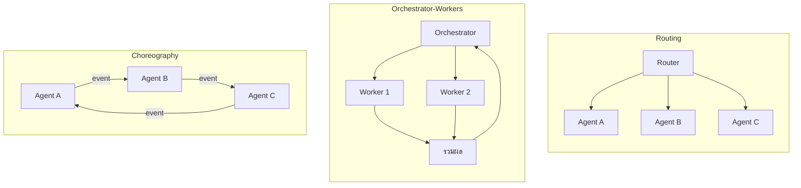
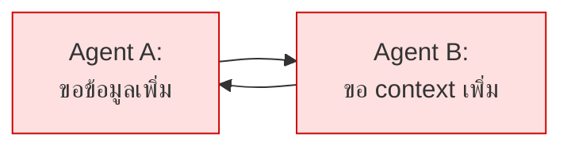

# Module 6 · Multi-Agent & Orchestration Patterns

**13:00 – 13:45** · เป้าหมาย: รู้จักรูปแบบการส่งต่องาน และรู้ว่า**เมื่อไหร่ไม่ควรใช้**

---

## 1. รูปแบบหลัก 3 แบบ



| รูปแบบ | ใครตัดสินใจ | เหมาะกับ | ความเสี่ยง |
|---|---|---|---|
| **Routing** | ตัวกลางตัวเดียว | งานที่แยกประเภทได้ชัด | routing ผิด = ผิดทั้งงาน |
| **Orchestrator-Workers** | ตัวกลางสั่งและรวมผล | งานที่แตกเป็นส่วนย่อยได้ | ต้นทุนประสานงานสูง |
| **Choreography** | ไม่มีใครคุม แต่ละตัวฟัง event | ระบบใหญ่ กระจายศูนย์ | **debug ยากมาก · loop ง่าย** |

---

## 2. ระบบนี้ใช้แบบไหน และทำไม

ระบบนี้ใช้ **Planner ตัวเดียว** ซึ่งไม่ใช่ multi-agent เลย

เหตุผล:

| | Planner ตัวเดียว (ที่ใช้) | Multi-agent |
|---|---|---|
| เรียก LLM ต่อคำถาม | 2-3 ครั้ง | 5-8 ครั้ง |
| เวลาตอบ | เร็วกว่า | ช้ากว่า |
| วางแผนข้ามระบบ | **ทำได้ดี** เพราะเห็น tool ครบพร้อมกัน | ต้องประสานงานเพิ่ม |
| debug | ตามได้ตรงๆ | ต้องไล่หลายตัว |

> **19 tools บนโมเดลเดียวยังจัดการได้สบาย** ต้นทุนการประสานงานของ multi-agent จึงยังไม่คุ้ม

`apps/agent-api/agent/orchestrator.py` มีเวอร์ชัน Orchestrator-Workers `uv run solutions/day2/workshop2_agent.py` ให้ **เพื่อเทียบ ไม่ใช่เพื่อใช้**

### เมื่อไหร่ที่ multi-agent เริ่มคุ้ม

- tool เกิน ~50 ตัว จนใส่ใน context พร้อมกันไม่ไหว
- แต่ละโดเมนต้องการ system prompt ที่ต่างกันมาก
- ต้องใช้โมเดลคนละตัวกับงานคนละแบบ
- ทีมคนละทีมดูแลคนละ agent และ deploy แยกกัน

---

## 3. การสื่อสารระหว่าง Agent

ไม่ว่าจะใช้รูปแบบไหน ข้อความที่ส่งต่อกันควรมีอย่างน้อย:

```python
class AgentMessage(BaseModel):
    from_agent: str
    to_agent: str
    task: str
    context: dict
    depth: int        # กัน loop
    trace_id: str     # ตามรอยได้ตลอดสาย
```

**`depth` และ `trace_id` ไม่ใช่ของเสริม** — ระบบ multi-agent ที่ไม่มีสองฟิลด์นี้จะกลายเป็นระบบที่ debug ไม่ได้ทันทีที่เกิดปัญหา

มาตรฐานที่กำลังก่อตัว: Agent2Agent (A2A), ACP — ยังเปลี่ยนเร็ว ควรออกแบบให้เปลี่ยนได้

---

## 4. Infinite Loop — ปัญหาที่ต้องกันตั้งแต่ต้น



### รูปแบบ loop ที่พบจริง

| รูปแบบ | ตัวอย่าง |
|---|---|
| ปิงปอง | สองตัวโยนงานกลับไปกลับมา |
| retry ไม่จบ | tool คืน "ไม่พบ" โมเดลตัดสินใจค้นใหม่ทุกครั้ง |
| fuzzing argument | เรียก tool เดิมโดยเปลี่ยน argument ไปเรื่อยๆ |
| วางแผนวน | re-plan แล้วได้แผนเดิม |

### กันด้วย 3 ชั้นพร้อมกัน

โปรเจกต์นี้ทำใน `apps/agent-api/agent/executor.py` คลาส `LoopGuard`:

```python
1. total_steps > MAX_STEPS                    # งบรวม
2. เรียก tool เดิมด้วย argument เดิมซ้ำ         # ปิงปองและ retry
3. เรียก tool เดิมเกิน N ครั้ง                 # fuzzing argument
```

**ชั้นเดียวเอาไม่อยู่** — งบรวมอย่างเดียวยอมให้วน 8 รอบก่อนหยุด ซึ่งช้าและเปลือง

ทดสอบ: `tests/test_loop_guard.py`

---

## 5. ทดลองเทียบด้วยตัวเอง (15 นาที)

รันคำถามเดียวกันสองแบบ แล้วเทียบ

```python
# แบบที่ใช้จริง
plan = await planner.create_plan(q)

# แบบ multi-agent
decision = await orchestrator.route(q)
```

| วัด | Planner เดียว | Orchestrator |
|---|---|---|
| จำนวนครั้งที่เรียก LLM | | |
| token รวม | | |
| เวลารวม | | |
| ตอบถูกไหม | | |

ใช้คำถาม **Q21** จาก `data/questions/L3-three-source.yaml`

---

## 6. ต่อไป

→ [Lab 2: Intent Gate](lab2-intent-gate.md) และ [Lab 3: Context Memory](lab3-context-memory.md)
