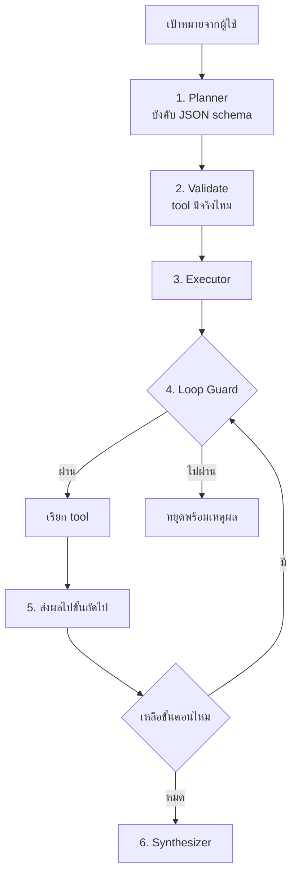

# Workshop 2 · เขียน Agent Loop ด้วยตัวเอง

**14:45 – 16:00** (75 นาที)

---

## โจทย์

เขียนระบบ agent ขึ้นมาเองด้วย Python โดยให้มีความสามารถ **ค้นหาข้อมูล · แปลงไฟล์ · ส่งอีเมล** และให้ระบบ **วนคิดเองว่าต้องทำขั้นตอนไหนก่อนหลัง**

> **ห้ามใช้ LangChain, LlamaIndex หรือ framework agent ใดๆ**
> เป้าหมายคือเข้าใจกลไกจริง ไม่ใช่ใช้ของสำเร็จ

---

## เป้าหมายที่ระบบต้องทำได้

> *"หา ticket ที่ยังไม่ปิดของสัปดาห์นี้ ทำรายงานสรุป แล้วส่งเมลให้ทีม NOC"*

ระบบต้องคิดเองว่าต้อง: ค้นหา → สรุป → สร้างไฟล์ → ส่งเมล ตามลำดับที่ถูกต้อง

---

## เครื่องมือที่ต้องมี

| Tool | ทำอะไร | ใช้อะไร |
|---|---|---|
| `search_tickets` | ค้น ticket จาก PostgreSQL | `psycopg` |
| `count_log_events` | นับ log จาก OpenSearch | `opensearch-py` |
| `get_device_neighbors` | ดู topology จาก Neo4j | `neo4j` |
| `export_report` | แปลงเป็น Markdown / CSV / PDF | `apps/agent-api/tools/file_export.py` |
| `send_notification` | ส่งเมลไป MailHog | `apps/agent-api/tools/notifier.py` |

ตรวจผลเมลที่ http://localhost:8025

---

## โครงที่ต้องเขียน



### 1. Planner
ใช้ `complete_structured()` จาก Workshop 1 บังคับให้ได้ `Plan` ที่มี `steps` และ `depends_on`

### 2. Validate
ตัดขั้นตอนที่อ้าง tool ที่ไม่มีอยู่จริงออก **ก่อน**เริ่มรัน

### 3. Executor
รันตามลำดับ dependency ขั้นที่ไม่ขึ้นต่อกันให้รันพร้อมกันด้วย `asyncio.gather`

### 4. Loop Guard — 3 ชั้น
```python
1. total_steps > MAX_STEPS
2. เรียก tool เดิม + argument เดิม ซ้ำ
3. เรียก tool เดิมเกิน N ครั้ง
```

### 5. ส่งผลระหว่างขั้น
ขั้นที่ 2 ต้องใช้ผลของขั้นที่ 1 ได้ เช่น `argument_from = {"device_ids": "step.1.tickets.*.device_id"}`

### 6. Synthesizer
รวมผลทุกขั้นเป็นคำตอบ **พร้อมอ้างอิงว่าข้อมูลมาจากไหน**

---
### เฉลยอยู่ใน `apps/mcp-server/tools/notifications.py`

คำสั่งสำหรับพิมพ์ในช่องแชต:
```
ค้นหา ticket ที่ยังไม่ปิดของสัปดาห์นี้ แล้วส่งอีเมลสรุปไปที่ noc@nt.co.th
โดยให้เขียนเนื้อหาอีเมลในรูปแบบที่ดูเป็นมืออาชีพ (ภาษาไทย) ประกอบด้วย:

1. คำทักทายทีม NOC อย่างเป็นทางการ

2. สรุปภาพรวมสั้นๆ ว่าสัปดาห์นี้พบปัญหากี่เคส และเป็นระดับ High กี่เคส

3. แทรกข้อมูล Ticket ทั้งหมดในรูปแบบ "ตาราง" (แสดงหมายเลข, ระดับ, อุปกรณ์, และหัวข้อ)

4. คำลงท้ายแจ้งให้ทีมงานทราบและดำเนินการ พร้อมลงชื่อจาก "ระบบ AI Agent"
```
---

## เชื่อมกับ UI

ทำให้ Chainlit แสดง `cl.Step` ของแต่ละขั้นได้ ผู้เรียนจะเห็นวงจรการคิดของ agent บนหน้าจอจริง

---

## เกณฑ์ผ่าน

- [ ] เป้าหมายหลักทำได้ครบ: ค้น → รายงาน → ส่งเมล และเห็นเมลใน MailHog
- [ ] Plan ที่ได้มี `depends_on` ที่ถูกต้อง
- [ ] ขั้นที่ไม่ขึ้นต่อกันรันขนานจริง (วัดเวลาเทียบได้)
- [ ] Loop Guard ทำงาน — ทดสอบโดยจงใจสร้างสถานการณ์วน
- [ ] เมื่อ tool ล้มเหลว ระบบไม่ crash และรายงานว่าขั้นไหนล้ม
- [ ] คำตอบมี citation
- [ ] UI แสดง step ได้

---

## โบนัส

1. **Re-plan** — เมื่อขั้นตอนล้มเหลว ให้วางแผนใหม่ 1 ครั้ง (ระวัง loop)
2. **ส่งเป็น Telegram** — สลับ `NOTIFIER_BACKEND` โดยไม่แก้โค้ด agent เลย
3. **เทียบกับ multi-agent** — รันด้วย `orchestrator.route()` แล้วเทียบ token/เวลา/ความถูกต้อง
4. **แนบ PDF** — ให้เมลมีไฟล์รายงานแนบไปด้วย

---

<details>
<summary>Hint</summary>

- เริ่มจากทำให้ plan ถูกก่อน อย่าเพิ่งสนใจ executor
- ทดสอบ executor ด้วย plan ที่เขียนมือ ก่อนต่อกับ LLM
- ใช้ `gemma3:4b` ระหว่างพัฒนา แล้วค่อยเปลี่ยนเป็น 27b ตอนส่ง
- `resolve_reference()` ใน `apps/agent-api/agent/executor.py` มีตัวอย่างการ resolve path แบบ `step.1.tickets.*.device_id`
</details>

---

## สิ่งที่ต้องส่ง

โค้ด agent ทั้งหมด + ภาพหน้าจอ MailHog + plan JSON ที่ระบบสร้าง
