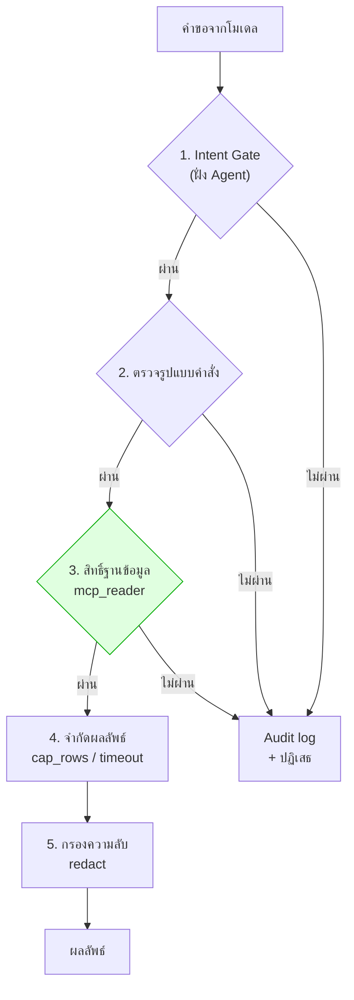
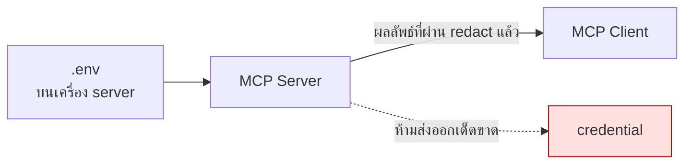

# Module 8 · ความปลอดภัยและการเลือก SDK

**10:45 – 11:35** · เป้าหมาย: ออกแบบ MCP Server ที่ปลอดภัยพอจะต่อกับฐานข้อมูลจริงขององค์กร

---

## 1. หลักการเดียวที่ต้องจำจากโมดูลนี้

> **Guardrail ที่เขียนไว้ใน prompt คือ "คำขอ"**
> **Guardrail ที่เขียนไว้ในโค้ดและสิทธิ์ คือ "กฎ"**

Prompt injection เอาชนะคำขอได้เสมอ แต่เอาชนะสิทธิ์ระดับฐานข้อมูลไม่ได้

---

## 2. ชั้นป้องกัน 5 ชั้น



**ชั้นที่ 3 คือชั้นเดียวที่ prompt injection ชนะไม่ได้ไม่ว่าจะเก่งแค่ไหน**

### Permission Layer — ทำที่ฐานข้อมูล

`docker/postgres/init/99_readonly_role.sql`:

```sql
CREATE ROLE mcp_reader LOGIN PASSWORD '...';
GRANT SELECT ON ALL TABLES IN SCHEMA public TO mcp_reader;
REVOKE CREATE ON SCHEMA public FROM mcp_reader;
ALTER ROLE mcp_reader SET statement_timeout = '15s';
```

**ลองด้วยตัวเองที่ pgAdmin** — ล็อกอินด้วย `mcp_reader` แล้วรัน:

```sql
UPDATE tickets SET severity = 'low';
```

จะถูกปฏิเสธที่ระดับฐานข้อมูล ไม่ว่าโมเดลจะถูกหลอกด้วยวิธีไหนก็ตาม

### Sandboxing — Tool ที่อันตราย

| ความเสี่ยง | วิธีคุม |
|---|---|
| รันสคริปต์ตามใจ | **Allowlist เท่านั้น** — `ALLOWED_SCRIPTS` ใน `apps/agent-api/tools/reports.py` |
| ประกอบ command line | ใช้ `subprocess.run(argv, shell=False)` ห้าม `shell=True` |
| สคริปต์ค้าง | `timeout=30` |
| output ท่วม | `MAX_OUTPUT_CHARS` |
| อ่านไฟล์นอกขอบเขต | `safe_path()` resolve แล้วเทียบว่าอยู่ใต้ root จริง |

> **"ชื่อสคริปต์" ต้องเป็นชุดปิดที่นักพัฒนากำหนด ไม่ใช่ string ที่โมเดลส่งมา**

### Secrets



`redact()` ทำงานกับ **ทุกข้อความที่ออกจาก tool** รวมถึงข้อมูลที่ดึงจากฐานข้อมูล เพราะ config snippet อาจมี SNMP community string ปนอยู่

---

## 3. Audit Log

ทุกครั้งที่ปฏิเสธหรือตัดผลลัพธ์ ต้องบันทึก

```python
AuditEvent(tool=..., decision="blocked", reason=..., detail=...).emit()
```

**และข้อความปฏิเสธที่ส่งกลับต้องไม่เผยโครงสร้างภายใน** — บอกว่าถูกปฏิเสธเพราะอะไรในระดับที่ผู้ใช้เข้าใจ แต่ไม่บอกชื่อตาราง ชื่อ role หรือ path

---

## 4. เลือก SDK: Python หรือ TypeScript

| | Python SDK | TypeScript SDK |
|---|---|---|
| เหมาะกับ | ทีม data/backend, งาน ML | ทีม frontend, deploy บน edge |
| ระบบนิเวศฐานข้อมูล | ครบมาก | ครบพอใช้ |
| deploy แบบ serverless | ทำได้ | **ทำได้ดีกว่า** |
| ในโครงการนี้ | **เลือกตัวนี้** | — |

**เหตุผลที่เลือก Python**: ฐานข้อมูลทั้ง 3 ตัวมี driver ที่โตเต็มที่ · ทีมที่ดูแล MPLS LLM ใช้ Python อยู่แล้ว · โค้ดวันที่ 1-2 เป็น Python ทั้งหมด ต่อกันได้ทันที

รายละเอียดเปรียบเทียบพร้อมโค้ดตัวอย่างสองภาษา: [reference/sdk-comparison.md](../reference/sdk-comparison.md)

### FastMCP หรือ SDK ดิบ

โปรเจกต์นี้ใช้ `FastMCP` (อยู่ใน official SDK) เพราะประกาศ tool ด้วย decorator ได้เลย ทำให้เห็น **สิ่งที่สอน** ไม่ใช่ boilerplate

```python
@mcp.tool(annotations={"readOnlyHint": True})
def search_tickets(status: str | None = None, range: str = "last_30d") -> dict:
    """คำอธิบายนี้กลายเป็น description ที่โมเดลเห็น"""
```

type hint กลายเป็น `inputSchema` และ docstring กลายเป็น `description` โดยอัตโนมัติ

---

## 5. OAuth 2.1 — รู้ไว้ แต่ยังไม่ใช้

spec รุ่นใหม่กำหนดให้ MCP server ที่เปิดบนเครือข่ายทำตัวเป็น OAuth Resource Server

โปรเจกต์นี้ **ไม่ทำ** เพราะอยู่ใน internal network และเป้าหมายคือสอน MCP ไม่ใช่สอน OAuth

**แต่ต้องรู้ว่าเมื่อขึ้น production จริงต้องมี** โดยเฉพาะเมื่อ NEX จะเรียกใช้ผ่านเครือข่ายองค์กร

---

## 6. เช็คลิสต์ก่อนเปิด MCP Server ให้ระบบจริง

- [ ] บัญชีฐานข้อมูลเป็น read-only จริง (ทดสอบด้วยการลอง UPDATE)
- [ ] มี statement timeout
- [ ] จำกัดจำนวนแถวและขนาด output
- [ ] tool ที่รันสคริปต์ใช้ allowlist ไม่ใช่ string จากโมเดล
- [ ] path ทุกเส้นถูก resolve และตรวจว่าอยู่ในขอบเขต
- [ ] มี redact ครอบทุก output
- [ ] มี audit log ทุกการปฏิเสธ
- [ ] secrets อยู่ในตัวแปรสภาพแวดล้อม ไม่อยู่ในโค้ด
- [ ] ประกาศ `readOnlyHint` / `destructiveHint` ให้ครบ
- [ ] มี auth เมื่อเปิดบนเครือข่าย

---

## 7. ต่อไป

→ [โจทย์ที่ 5: Guardrail Red-team](challenge5-guardrail-redteam.md)
